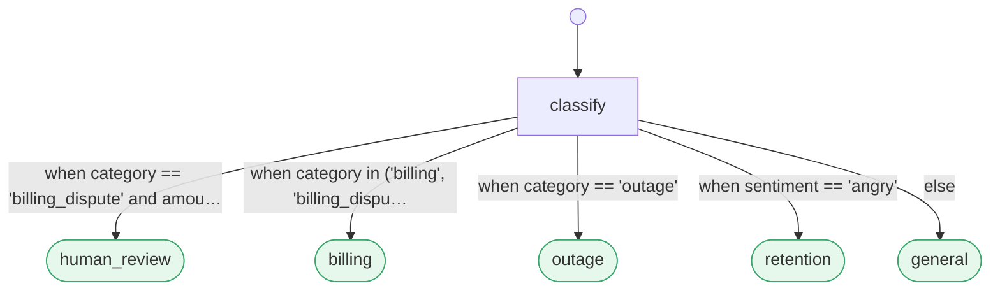

# PrismPath: a control plane you can prove

> **This is the lean product mirror of [crystal-warden/prism-path](https://github.com/crystal-warden/prism-path).** It is generated: the runnable control plane and its tooling, nothing more. The research, the FQ paper, the evidence ledger timestamped to Bitcoin, and the hardware and kernel substrates all live in that repo.

[](https://github.com/crystal-warden/prism-path/actions/workflows/ci.yml)
&nbsp;[](LICENSE)
&nbsp;[](https://doi.org/10.5281/zenodo.21816125)

**One signed policy, authored as a Markdown document, that decides byte identically from a Linux kernel to
an 8 bit MCU, coordinates a swap across a wireless fleet, and is tamper evident by construction.**
PrismPath is a decidable match action control plane: the entire policy is one inspectable, signed
artifact, so you can prove it, port it, sign it, and hot swap it, and every proof is machine checked in CI.

Provability is the whole point. Every routing decision is total and decidable (Level M), every safety
property is model checked, and the exact same signed table runs identically across a dozen substrates,
from the kernel to an FPGA fabric to bare metal silicon. And because that policy is a document your team
can read, a workflow you can read is one you can **diff, lint, test, lock, and prove**, five shipped
commands with no Python callback in sight: a routing change lands as a prose diff a non engineer approves,
which the engine renders as a live before and after graph in the pull request itself.

**[Try it in your browser.](https://www.crystalwardenlabs.com/playground)** The kernel runs client side;
nothing to install, nothing you type leaves the page.

## One signed policy, proven everywhere

- **Every substrate, byte identical.** The same table decides identically from a Linux kernel (eBPF/XDP)
  to an FPGA fabric to bare metal MCUs across four ISAs (8 bit AVR, ARM Cortex-M33, RISC-V, Xtensa),
  124/124 on the conformance subset each.
  [hardware](https://github.com/crystal-warden/prism-path/blob/main/prismpath-hw/README.md) · [conformance](prismpath/portable/conformance/README.md)
- **Swapped across a fleet, verified per node.** Three wireless nodes reverify a signed table (refuse, do
  not downgrade) and flip together with sub millisecond simultaneity, behind a two phase commit.
  [mesh demo](https://github.com/crystal-warden/prism-path/blob/main/prismpath-hw/mesh/README.md)
- **Decidable and tamper evident.** Every decision is provably total (Level M) and travels over
  Facet, PrismPath's decision wire protocol, 66.9x smaller than OTLP and anchored to a Merkle log
  plus OpenTimestamps.
  [spec](PROTOCOL.md) · [paper](https://github.com/crystal-warden/prism-path/blob/main/docs/research/paper-facet-figueroa-quantization.md)

Everything above is reproducible from this repo; the evidence is timestamped to Bitcoin.

## The whole idea in one file

```markdown
---
name: support_triage
start: classify
---

## classify
Read the incoming support ticket. Emit `category`, `amount`, and `sentiment`.
-> human_review: when category == "billing_dispute" and amount > 500
-> billing: when category in ("billing", "billing_dispute")
-> outage: when category == "outage"
-> retention: when sentiment == "angry"
-> general: else

## human_review
A person decides. High-value billing disputes are never auto-routed.

## billing
Apply the standard billing workflow.

## outage
Page the on-call engineer.

## retention
Hand off to the retention team.

## general
Answer from the support knowledge base.
```

That file **is** the program. Here it is as the engine sees it, verbatim `prismpath graph` output, not a
drawing:



Because the flow is data, **a pull request is a process change**: the `human_review` rule lands as a
three-line prose diff, a fixture row asserts it in CI (milliseconds, no model), and merging changes
production routing with no deploy and no engineer in the loop. **See it run:**
[`examples/pr_demo/`](prismpath/examples/pr_demo/README.md).

## Routing is a spectrum the engine chooses, not the author

| edge kind | syntax | how it routes | cost |
|---|---|---|---|
| **deterministic** | `-> t: when <expr>` (also `always` / `else` / `false`) | a safe predicate over the agent's structured outcome (plus a `visits` counter) | free, exact |
| **semantic** | `-> t: <natural language>` | embed the outcome against the condition; escalate to a one-shot LLM only on low confidence | ~free, rare LLM |

At a node, deterministic edges evaluate first, in document order, and **first true wins**; only if none
match does a semantic edge reach the router. The engine picks the cheapest tier that can decide, so you
pay a model exactly where meaning is genuinely required and nowhere else. The rest of the machinery (agent
contract, prefilter cache, `verify`, fan-out, attestation, the portable kernels) is a ten-minute read:
**[docs/guides/tour.md](docs/guides/tour.md)**.

## The worker is yours; the control plane is PrismPath's

A node's worker is whatever does the work: an LLM agent, a plain function (a
[code node](docs/guides/code-nodes.md)), a shell script, or an entire tool run wrapped as a worker. The
[mdflow interop example](prismpath/examples/mdflow_interop/pipeline.md) drives another task runner's tasks
as PrismPath nodes. Pair PrismPath with a tool like that and you keep its open-ended, agentic expression
while PrismPath decides *where the run goes next* (provably) and records *what happened* (the git
Flow-Ledger). You don't trade agentic work for governance; you wrap one inside the other. Expression stays
with the worker, control and observability stay with the kernel.

## It runs all the way down: to the FPGA and inside the kernel

Most of what routes agents is a heavy Python runtime. PrismPath's deterministic core is a **decidable
match-action fragment** ([SPEC §4.3](SPEC.md)), and a decidable thing is portable to places a runtime
can't go. **One fixed interpreter; every flow is data.** Edit the Markdown, recompile a small binary
table, and the circuit or program never changes:

- **FPGA fabric.** A Level M flow compiles to a block-RAM table image (`incident_severity` = **136
  bytes**; `wazuh_triage`, the production SOC flow unmodified, = 302 bytes). On a Zynq-7020 at 50 MHz a
  routing decision is **5 to 21 cycles (100 to 420 ns)** in **1,064 LUTs, 2.0% of the part**; the RTL
  reproduced **7,436 live sensor samples** bit-for-bit against the C reference.
  ([`prismpath-hw/`](https://github.com/crystal-warden/prism-path/blob/main/prismpath-hw/README.md))
- **Linux kernel / eBPF.** The same table compiles to a **verifier-accepted XDP program**, certified
  in-kernel against the frozen corpus. On a live-traffic mirror it classifies real packets at **132 to 182
  ns/packet (~5.5 to 7.6 Mpps/core)**, and its **policy hot-swaps live from a Markdown edit**: repopulate
  the running program's maps, no detach, no reload. Each swap can be cryptographically **authorized,
  envelope-checked, and audited** (secure hot swap, published as prior art:
  [`docs/design/spec-secure-hotswap.md`](docs/design/spec-secure-hotswap.md)).
  ([`prismpath-ebpf/`](https://github.com/crystal-warden/prism-path/blob/main/prismpath-ebpf/README.md))

Both are certified on a **declared subset** of the frozen vectors. This is the portability pattern taken
one level below software, never claimed as full SPEC §8 conformance, with every excluded vector carrying a
machine-readable reason.

## Measured, not asserted

N=301 labeled routing decisions, 7 flows, the same local model for every arm
([benchmark/](prismpath/benchmark/), reproducible):

| arm | accuracy | LLM calls / 1k decisions | median latency | p95 |
|---|---|---|---|---|
| **PrismPath** (hybrid over learned centroids, δ=0.03) | **95.3%** | **360** | **205 ms** | 655 ms |
| **PrismPath** (economy point, δ=0.01) | 90.0% | **160** | ~205 ms | n/a |
| PrismPath (zero-shot hybrid, δ=0.05) | 83.7% | 383 | 205 ms | 655 ms |
| LangGraph / CrewAI / LLM-router | 99.0% | 1000 | ~435 ms | ~460 ms |

```bash
python -m prismpath.comparisons.run_comparison   # reproduce against your own endpoint
```

The trade is a **dial, not a verdict**. LLM-on-doubt over learned per-condition centroids (5-fold
cross-validated) hits 95.3% at **2.8× fewer LLM calls** and about half the median latency; turn δ up (or
derive τ with `prismpath calibrate`) to trade toward ~99.7% at always-call prices. The external arms are
more accurate out of the box because they pay the model on *every* transition. If call volume is
irrelevant to you, that's the right trade and you should use them. PrismPath's whole point is spending the
model only where it earns its cost.

## Correctness you can check, not an author you have to trust

Much of this code was written by AI agents under a gated control plane, the same one this repo ships. So
the project is built on a bet: **correctness shouldn't depend on trusting whoever (or whatever) wrote
it.** Everything is therefore checkable.

- **[1,079 predicate + 27 flow conformance vectors](prismpath/portable/conformance/README.md)**, frozen,
  passed bit-for-bit by the Python reference *and* three independent re-implementations
  ([JS](prismpath/portable/README.md), [Rust](prismpath-rs/CONFORMANCE.md), [Go](prismpath-go/README.md)).
  Four kernels, four languages, one answer: the one check a plausible-looking codebase can't fake.
- **~890 tests**: 649 in the kernel package, 227 across the two adapters (telemetry, fusion), 18 in the
  Node kernel, plus a fuzz-hardened predicate sandbox. [Run them yourself](#running-the-tests).
- **[A reproducer for every measured number](https://github.com/crystal-warden/prism-path/blob/main/docs/research/supporting-evidence.md)**: each claim maps to
  the script that made it, the benchmark table regenerates with one command, and the silicon and kernel
  rows (#72 to #78) are each anchored in Bitcoin via OpenTimestamps. **Check the artifact, not the
  author.**
- **[Machine-enforced boundaries](tools/arch_guard.py)**: the standing rule is *never write a completeness
  claim a gate doesn't enforce*, and it binds the authors too, since agent-written code landed only after
  it compiled, passed the suites, and survived the gates.

## Quickstart

```bash
git clone https://github.com/crystal-warden/prism-path.git && cd prism-path
pip install -e .                                          # numpy only; embedder is an optional extra
prismpath validate prismpath/examples/pr_demo/triage.md   # "your flow compiles"
prismpath test prismpath/examples/pr_demo/triage.md       # fixture-asserted routing, no model
```

Or skip the terminal entirely: the [live playground](https://www.crystalwardenlabs.com/playground) runs
the portable kernel in your browser (it also ships offline at
[`portable/playground.html`](prismpath/portable/playground.html)).
**[GETTING_STARTED.md](GETTING_STARTED.md)** goes from clone to a real agent driving your own flow in
eight steps, each run before it was written down.

## One engine, many domains

The engine owns routing, attestation, and the toolchain; **domains plug in behind ports** (Ingestion,
Retrieval, Adjudicator, Action/Sink, Attestation, Deferral) with **no domain vocabulary in the core**:
`tools/arch_guard.py` fails the build if a domain noun leaks inward. Two reference adapters ride the
same ports, both the deterministic no-LLM class where the Adjudicator is a Level M flow (a proof, not a
model judgment):

- **Decision-preserving telemetry** (`adapters/telemetry/`): compress a flow's telemetry to the *minimum
  statistic that still reproduces its routing decisions*, entropy-coded on a self-framing wire and
  Merkle-verified end to end; benchmark-gated, arch-guard-isolated.
- **The decision fusion plane** (`adapters/fusion/`): joins any N decision sources into one Level M
  decidable, provable fused decision on a self-framing wire measured at ~45× under batched JSON
  (integrity apparatus counted). The v1 worked example fuses a cyber triage verdict with a live IMU's
  physical posture through one tessellation, proven end to end on the live rig
  ([evidence #82 to #86](https://github.com/crystal-warden/prism-path/blob/main/docs/research/supporting-evidence.md)).

## Where PrismPath is the wrong tool

Honesty is part of the identity, so here is where it loses:

- **A linear pipeline with no branching.** You don't need routing; write a script.
- **Maximum accuracy at any cost.** An LLM-on-every-transition router hits 99% here; if call volume
  doesn't matter, that edge is real and it isn't ours.
- **A hosted platform with a connector catalog.** PrismPath is a format plus kernel plus control plane,
  deliberately not a SaaS or an integration ecosystem.
- **Control flow that writes itself at runtime.** If the *graph* must be generated on the fly (an agent
  inventing its own next steps, unconstrained), reach for a generalist framework (LangGraph, CrewAI).
  PrismPath fixes the routing as auditable data; the open-ended work lives in the workers, not the graph.

The two strongest objections, *"structured output already solved routing"* and *"logic-as-data is just a
rules engine"*, get full answers (concessions included) in **[docs/objections.md](docs/objections.md)**;
the head-to-head against other paradigms lives in [comparisons/](prismpath/comparisons/README.md).

## Status

Working end to end: the flow kernel (parser / predicates / hybrid router / engine); the data-plane
toolchain (validate/lint, `test`, lockfile, calibrate, centroids, graph, import, label, portable, verify,
lsp); fan-out/composition with its Mission Control view; the durable layer (checkpoints, scheduler, git
Flow-Ledger, OTS anchoring, and a signed, envelope-checked policy hot-swap); the Connector SDK (six ports); the sprint control plane; and the portable
kernels, the Python reference plus three independent re-implementations (JS, Rust, Go), each passing all
**1,079 predicate + 27 flow vectors**. The Level M fragment additionally
[runs in FPGA fabric and as an in-kernel eBPF/XDP program](#it-runs-all-the-way-down-to-the-fpga-and-inside-the-kernel),
each certified on a declared subset. **649 Python + 18 Node kernel tests pass** (the two adapters add
227 more, with adversarial attestation-tamper and property coverage); the format is specified in
[SPEC.md](SPEC.md) (v1 draft). This repo is a curated export of an active research control plane. Licensed
Apache-2.0 (see [LICENSE](LICENSE) and [NOTICE](NOTICE)). You may fork it and ship it, including inside a proprietary product; a redistributor keeps the LICENSE and NOTICE files and marks changed files, and Apache-2.0 requires no user-facing attribution.

**The launch is anchored.** The project that ships tamper-evident attestation pointed its own machinery at
itself: the `v0.1.0` release artifact is OpenTimestamps-anchored in **Bitcoin block 961224** (2026-08-06).
Don't take our word, or GitHub's timestamps; rebuild from the tag and check the chain:

```bash
git archive --format=tar.gz --prefix=prismpath-0.1.0/ v0.1.0 | sha256sum
# b3f07facaacc4daaead1cc8f53caf4637b7b1aaf1a165b3c50b949566ce52112
ots verify prismpath-0.1.0.tar.gz.ots   # .ots proofs ship with the release
```

## Docs and contributing

Start at the **[docs index](docs/README.md)**; the [decoder-ring](docs/decoder-ring.md) is the glossary
and repo map (every borrowed term in plain language, and where every module, kernel, and command lives).

- **Format and design:** [SPEC.md](SPEC.md) · [ten-minute tour](docs/guides/tour.md) ·
  [authoring](docs/guides/authoring.md) · [control plane](docs/design/control-plane.md) ·
  [architecture](docs/design/architecture.md) · [ledger anchoring](docs/design/spec-ledger-opentimestamps.md).
- **Research:** [primer](https://github.com/crystal-warden/prism-path/blob/main/docs/research/primer-students-guide.md) ·
  [routing-spectrum paper](https://github.com/crystal-warden/prism-path/blob/main/docs/research/paper-routing-spectrum.md) ·
  [engineering white paper](https://github.com/crystal-warden/prism-path/blob/main/docs/research/whitepaper-engineering.md) ·
  [supporting evidence](https://github.com/crystal-warden/prism-path/blob/main/docs/research/supporting-evidence.md).
- **Contribute:** [CONTRIBUTING.md](CONTRIBUTING.md). The perfect first PR is a lint rule (ten are
  waiting); DCO sign-off, not a CLA. Use it in CI via the [`prismpath` GitHub Action](action.yml) or the
  [pre-commit hooks](.pre-commit-hooks.yaml). Real workflows welcome in the
  [gallery](prismpath/gallery/README.md).
- Also: [CODE_OF_CONDUCT.md](CODE_OF_CONDUCT.md) · [SECURITY.md](SECURITY.md) · [ROADMAP.md](ROADMAP.md) ·
  [CHANGELOG.md](CHANGELOG.md) · [CITATION.cff](CITATION.cff).

> **Commercial support and custom flows.** PrismPath is developed by Crystal Warden Labs; we build
> custom decidable flows and stand up the provable control plane around them, from the kernel to the
> FPGA to bare-metal MCUs, and support teams adopting it.

## Running the tests

```bash
python -m pytest prismpath/tests -q               # kernel: parser, predicates, router, engine
python -m pytest adapters/telemetry -q            # each adapter is self-rooted, so run them separately
python -m pytest adapters/fusion -q
node --test prismpath/portable/prismpath.test.mjs # the portable JS kernel
```
