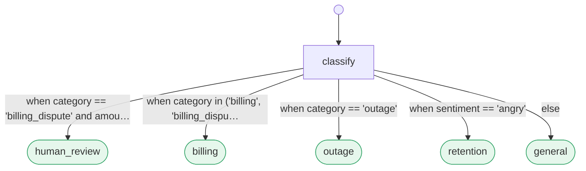

# The ten minute tour

The engineer's walk through the flow kernel: everything the README summarizes in a
line, at working depth. [GETTING_STARTED.md](../../GETTING_STARTED.md) is the *do it*
version; this is the *read it* version.

## The routing spectrum

Routing is a **spectrum chosen by the engine, not the author**:

| edge kind | syntax | how it routes | cost |
|---|---|---|---|
| **deterministic** | `-> t: when <expr>` (also `always`/`else`/`false`) | a safe predicate over the worker's structured outcome (+ a `visits` counter) | free, exact |
| **semantic** | `-> t: <natural language>` | embed the outcome vs the condition; escalate to a 1 shot LLM only on low confidence | ~free + rare LLM |

> *Logic where logic exists, intent where it doesn't.* Negation, counts, and thresholds are written
> as `when ...` predicates (free, never misroute); genuine judgment is left to the hybrid router. At a
> node, **deterministic edges are evaluated first, in document order, first true wins**; only if none
> match do the semantic edges go to the router.

### A minimal flow

```markdown
---
name: coding
start: write_code
---

## write_code
Write or revise the function so it passes the tests.
-> run_tests: when always

## run_tests
Run the hidden test suite.
-> done: when tests_pass
-> give_up: when visits > 3
-> debug: when not tests_pass

## debug
Judge whether the fix is clear or the task is unsolvable.
-> write_code: the fix is clear, edit the code and try again
-> give_up: the problem is unsolvable

## done
All tests pass.

## give_up
Too many attempts.
```

### The worker contract

The engine is worker agnostic. You pass `run(graph, worker, router=...)` where:

```python
worker(node_name: str, instruction: str, state: dict) -> str | dict
```

- Return a **string** → it becomes the text used for semantic routing.
- Return a **dict** `{"text": ..., <field>: <value>, ...}` → `text` feeds semantic routing and the
  other fields are the variables the deterministic `when` predicates see (e.g. a `run_tests` node
  returns `{"tests_pass": True, "text": "all tests passed"}` so `-> done: when tests_pass` fires
  deterministically).

`state` is a dict shared across the whole run; the engine seeds `state["transcript"]` and
`state["visits"]` (per node entry counts). `run(...)` returns `RunResult(path, steps, stopped, state)`.

### Routers

```python
from prismpath.engine import run
from prismpath.router import HybridRouter, LLMRouter
from prismpath import llm_local

router = HybridRouter(LLMRouter(llm_local.generate), margin=0.05)  # recommended
run(graph, worker, router=router)
```

- `EmbeddingRouter()`: cosine only (cheap, ~0.82 on the routing bench).
- `LLMRouter(generate_fn)`: a 1 shot LLM picks the edge (accurate, costs a call).
- `HybridRouter(LLMRouter(...), margin=0.05)`: embed first; escalate to the LLM only when the
  top 1 to top 2 margin < `margin`. The frontier is smooth (rederived at N=301:
  `prismpath/benchmark/hybrid_sweep.py`); stack it over `CentroidRouter` for the measured best
  accuracy per call, and derive the margin with `prismpath calibrate` rather than hand picking.

### The prefilter cache: skip the expensive node entirely (opt in)

Routing is cheap; in *triage shaped* flows the cost concentrates in one **adjudication node**
(an LLM classification) whose inputs recur near identically. `PrefilterCache` memoizes its
verdicts: look the incoming document up before the call, a near identical prior (cosine ≥ 0.97)
whose verdict carried confidence ≥ 0.8 is reused and the call is **skipped**; a miss
adjudicates, then `learn()`s the fresh verdict so the cache compounds.

```python
from prismpath.prefilter import PrefilterCache

cache = PrefilterCache("corpus/")            # lazy; pluggable embed_fn
res = cache.lookup(document)
if res.hit:
    act_on(res.record["action"])             # LLM call skipped, reuse logged + auditable
else:
    verdict = expensive_adjudication(document)
    cache.learn(res.vector, verdict.action, verdict.confidence)
```

In a flow it's just a node with deterministic edges on the cached action; see
[`prismpath/flows/wazuh_triage.md`](../../prismpath/flows/wazuh_triage.md) (`vector_prefilter`). **Measured live on
alert triage: ~59% of alerts auto resolve at threshold 0.97 → ~2.4× capacity** before the LLM
tier is touched.

This is **use as needed, not an engine default**: nothing invokes it implicitly. It pays off
only when one node dominates cost, inputs genuinely recur, and a prior verdict is still valid
when the same input recurs; it is wrong for generative, novelty heavy, or context dependent
nodes. See [docs/guides/authoring.md](authoring.md) for the applicability test.

### Your flow compiles: static analysis

Because the flow *is* the graph (a Markdown file, not code scattered across Python), the whole
control structure is checkable **before you run anything**. A code first framework can't offer
this at all: there's no artifact to check until the code runs. `prismpath validate` runs a set of *decidable* checks (no model, no
embeddings) and exits non zero on any error:

| check | severity | what it catches |
|---|---|---|
| undefined start / edge target | error | an edge points at a node that isn't defined |
| unsafe / unparseable predicate | error | a `when` that isn't safe & well formed (see the sandbox) |
| no reachable terminal | error | the flow can only ever end at `max_steps` |
| unreachable node | warning | a node nothing routes to |
| possible stuck | warning | a deterministic only node whose conditions aren't provably exhaustive |
| shadowed edge | warning | an `always`/`else` catch all makes later (or semantic) edges dead |
| unbounded cycle | warning | a loop with no `visits`-based cap (bounded only by `max_steps`) |
| always false edge | warning | a dead condition like `when visits < 4 and visits > 10` |
| duplicate condition | warning | two identical semantic edges: a guaranteed router near tie |
| `@spawn` no join edge | error | a fan out node with no matching `on event <join>` edge (deadlock) |
| missing / terminal less child | error | a `@spawn` child flow is absent, unparseable, or never finishes |
| `@expect` unmet | warning | the parent expects a field the child never `@emits` (cross flow) |
| `@emits` type mismatch | warning | a typed declaration (`@emits(x=bool)`) contradicts how the `when` edges read the field |

The predicate reasoning is confined to the tiny decidable fragment the `when` language allows, so
there are **zero false positives** on the shipping flows (verified in the test suite). `--json`
emits machine readable findings for CI/pre commit; `prismpath lint` adds the one non decidable check
(semantic conditions that embed too similarly to route between). The last three checks **cross the
flow boundary**: composition is inspectable statically, no run required.

Beyond linting, **`prismpath verify`** answers reachability questions: *"can `human_review` ever
be reached?"*, *"prove `contain` is unreachable when `amount <= 500`"*, by bounded model checking
over the decidable tiers: exact verdicts with a concrete witness outcome over the **Level M
match action fragment** (SPEC §4.3), sound over approximation outside it, and UNREACHABLE proven
for all bounds via saturated `visits` modeling (`--reach` / `--forbid` / `--assume` / `--level-m`).

Level M isn't just for analysis: a flow inside the fragment *is* a match action table, and
tables run in places no framework runtime can follow: microcontrollers, smart sensors,
in kernel packet paths. The first of those places is now real: a fixed FPGA interpreter circuit
on a Zynq-7020 executes Level M flows as runtime loaded table images (136 bytes for the demo
flow), certified against a declared subset of the same frozen vectors:
[`prismpath-hw/`](../../prismpath-hw/README.md). What remains (WASM, XDP/eBPF,
P4) is listed honestly in [ROADMAP Phase 6](../../ROADMAP.md).

### Fan out and sub flow composition: parallelism without impurity

A **fan out node** spawns one durable child run per item and suspends until they join; a single
sub flow is just the N=1 case. The engine stays pure: it only records the worker's `spawn` data spec;
an out of band harness (`prismpath compose`) spawns the children under **deterministic ids** (so a restart
never double spawns), and delivers the join event (`all_done` / `any` / `quorum:k`) as an ordinary
`on event` edge. Fan in *semantics* live in the Markdown; concurrency *mechanics* live in the harness.
Children are ordinary checkpointed runs (durable, resumable, ledgered), the git ledger dedups child
units across parents, and `prismpath lock` pins the whole composition tree. See
[`flows/fanout_review.md`](../../prismpath/flows/fanout_review.md) + [`flows/review_one.md`](../../prismpath/flows/review_one.md).

### The portable subset: locked flows run anywhere

A flow whose reachable edges are all decidable (`when` predicates, error edges, event edges) needs
**no ML runtime for routing**, and that subset ships as [`portable/prismpath.mjs`](../../prismpath/portable/prismpath.mjs),
a single dependency free ES module (parser + sandboxed predicate evaluator + engine loop) that runs
in Node, a browser, an edge function, or a network appliance. **Try it in the browser:**
[`portable/playground.html`](../../prismpath/portable/playground.html) runs the kernel client side: paste a flow,
watch it parse, tier classify, graph, and route live.

`prismpath portable <flow>` computes the flow's **portability tier** for the whole composition tree:
**P0** (all edges decidable: zero ML, runs on the port), **P1** (semantic edges all pinned in the
lockfile: needs only an outcome side embedder; appliance deployable as one flow + one lock + one
encoder), **P2** (unlocked semantic edges: full engine). The port *refuses* non P0 flows rather
than guess. Routing fidelity is enforced by **frozen conformance vectors**
([`portable/conformance/`](../../prismpath/portable/conformance/README.md)): 1,079 predicate cases + 27 engine
fixtures generated from the Python reference, checked in both directions on every test run: the
spec is data, so a conforming kernel is provably interchangeable, and **three independent portable
kernels already are**: JavaScript (`prismpath/portable/prismpath.mjs`), Rust (`prismpath-rs/`),
and Go (`prismpath-go/`), each passing every vector. The production SOC triage
flow is P0: its routing is fully decidable; the LLM lives in the workers. See
[`portable/README.md`](../../prismpath/portable/README.md).

---

## Attestation, provenance & human override: "prove it"

The git Flow Ledger (`ledger.py`, gate green proof commits) is the base tier. On top of it PrismPath
ships an **attestation tier** that makes a decision *provable and tamper evident*, air gap friendly:

- **`ledger_airgap.provenance_manifest(...)`** binds a decision to its inputs: the policy (flow) hash,
  the gate id, the knowledge base hash, and the per input ingestion hashes, content addressed into a
  `manifest_hash`.
- **`ledger_airgap.verify_manifest(m)`** recomputes that content address; tampering with *any* bound
  field flips it false. That is what makes a manifest a tamper evidence anchor rather than a label.
- **`ledger_airgap.override_manifest(prior, overrider, rationale, new_root)`** records a **human
  override as a superseding commit**: the AI determination is attested first and stays immutable, and
  the override binds who/why/when and supersedes it, a provable *"the AI said X, auditor Y overrode to
  Z because …"* trail.
- **OpenTimestamps + RFC-3161** anchoring (`ledger_ots.py`, `ledger_airgap.py`) for an air gapped,
  third party verifiable timestamp tier.
- **`deferral.py`**: the Deferral/Resumption port: suspend a unit for human review or missing evidence
  discovery and resume it later, recording the actor. One primitive serves both HITL override and
  evidence request loops.

## A worked example: support triage, and a pull request as a process change

```markdown
---
name: support_triage
start: classify
---

## classify
Read the incoming support ticket. Emit `category`, `amount`, and `sentiment`.
-> human_review: when category == "billing_dispute" and amount > 500
-> billing: when category in ("billing", "billing_dispute")
-> outage: when category == "outage"
-> retention: when sentiment == "angry"
-> general: else

## human_review
A person decides. High-value billing disputes are never auto-routed.

## billing
Apply the standard billing workflow.

## outage
Page the on-call engineer.

## retention
Hand off to the retention team.

## general
Answer from the support knowledge base.
```

That file **is** the program. Here it is as the engine sees it, verbatim `prismpath graph` output, not a
drawing:



Because the flow is data, **a pull request is a process change**: the `human_review` rule lands as a
three-line prose diff, a fixture row asserts it in CI (milliseconds, no model), and merging changes
production routing with no deploy and no engineer in the loop. **See it run:**
[`examples/pr_demo/`](../../prismpath/examples/pr_demo/README.md).

## The worker is yours; the control plane is PrismPath's

A node's worker is whatever does the work: an LLM agent, a plain function (a
[code node](code-nodes.md)), a shell script, or an entire tool run wrapped as a worker. The
[mdflow interop example](../../prismpath/examples/mdflow_interop/pipeline.md) drives another task
runner's tasks as PrismPath nodes. Pair PrismPath with a tool like that and you keep its open-ended,
agentic expression while PrismPath decides *where the run goes next* (provably) and records *what
happened* (the git Flow-Ledger). You don't trade agentic work for governance; you wrap one inside the
other. Expression stays with the worker, control and observability stay with the kernel.

## One engine, many domains

The engine owns routing, attestation, and the toolchain; **domains plug in behind ports** (Ingestion,
Retrieval, Adjudicator, Action/Sink, Attestation, Deferral) with **no domain vocabulary in the core**:
[`tools/arch_guard.py`](../../tools/arch_guard.py) fails the build if a domain noun leaks inward. The Facet
wire itself ships in the package (`prismpath/telemetry/`, [PROTOCOL.md](../../PROTOCOL.md)) because it is
core infrastructure every adapter uses: it compresses a flow's telemetry to the distinctions that still
reproduce its routing decisions, entropy coded on a self framing wire and Merkle verified end to end. Two
reference adapters ride the ports:

- **The decision fusion plane** (`adapters/fusion/`): joins any N decision sources into one Level M
  decidable, provable fused decision on a self framing wire measured at about 45 times under batched JSON
  (integrity apparatus counted). The v1 worked example fuses a cyber triage verdict with a live IMU's
  physical posture through one tessellation, proven end to end on the live rig
  ([evidence #82 to #86](../research/supporting-evidence.md)).
- **The GRC adjudication adapter** (`adapters/compliance/`): the class whose Adjudicator may be a model,
  machine checkable controls deciding deterministically and prose objectives resolving fail closed, with
  evidence typed determinations ([evidence #137 to #139](../research/supporting-evidence.md)).

## From a decision to a receipt

Everything above proves what can happen and decides what may. The last step is the one an auditor cares
about: what happened, in a form that verifies without trusting the process that wrote it. Run the triage
flow twice, once above and once below the human review line, appending one receipt per decision to an
append only audit log, then read the trail:

```python
from prismpath.kernel.parser import parse_file
from prismpath.kernel.engine import run
from prismpath.kernel import causes
from prismpath.ledgers.audit_log import AuditLog

graph = parse_file("prismpath/examples/pr_demo/triage.md")
log = AuditLog("triage.audit.jsonl")

for amount in (700, 200):                                  # the same ticket, above and below the line
    def worker(node, instruction, state, amount=amount):   # stands in for your worker
        return {"category": "billing_dispute", "amount": amount, "sentiment": "neutral"}
    result = run(graph, worker)
    cause = causes.code("route:stuck") if result.stopped == "stuck" else 0
    for step in result.steps:
        log.append("gate", "decision", {"node": step.node, "target": step.target, "how": step.info.get("used"),
                                        "outcome": result.path[-1], "cause": cause})
print("root", log.current_root()[:16], "verifies", log.verify_log())
```

```bash
prismpath trail triage.audit.jsonl
# trail: triage.audit.jsonl  events 2 of 2  root 0375d60c23703633  verifies True
# decisions 2:
#   outcomes: human_review 1, billing 1
#   causes:   0 clean x2
```

Your root will differ, because the receipts carry their own timestamps; the shape will not.

Two decisions, two receipts, one Merkle root. Anchor the root with `prismpath ledger anchor` and a third
party can later show the log was not edited. The same shape holds when the decision was made by a kernel
program or a fabric: the receipt struct is the same, the cause byte is the same, and the
[operator's guide](operator.md) covers reading the trail day to day.

## Command cheatsheet (kernel: no model required)

```bash
# --- flow kernel (no model required) ---
python -m prismpath.cli validate prismpath/flows/coding.md   # static analysis: does the flow compile? (fast, no model)
python -m prismpath.cli validate prismpath/flows/release.md --json   # machine readable findings (CI / pre commit)
python -m prismpath.cli lint     prismpath/flows/triage_support.md   # validate + flag ambiguous semantic conditions (needs embedder)
python -m prismpath.cli test     prismpath/flows/coding.md   # assert routing from coding.tests.md (a Markdown table, no LLM)
python -m prismpath.cli lock     prismpath/flows/coding.md   # commit condition embeddings -> reproducible routing
python -m prismpath.cli graph    prismpath/flows/coding.md --fenced   # -> a Mermaid diagram for your README
python -m prismpath.cli run      prismpath/flows/coding.md   # run with a built-in mock worker; print path + stop reason
python -m prismpath.cli run      prismpath/flows/coding.md --worker ollama:llama3.2   # a real local model instead of the mock (`--agent` is the old spelling, still accepted)
```
